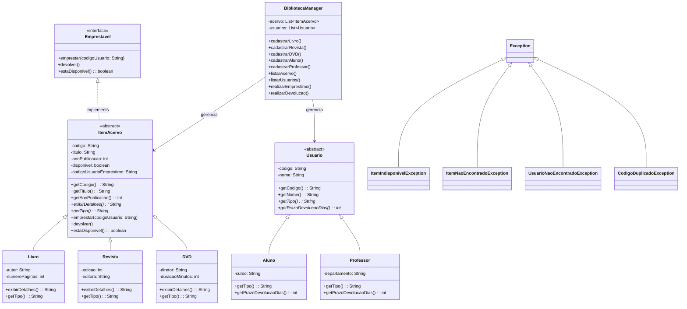

# Sistema de Gerenciamento de Biblioteca

**Disciplina:** Programação Orientada a Objetos  
**Integrante:** Bernardo Holanda  
**Linguagem:** Java

---

## Instruções para Compilar e Executar

A partir da pasta raiz do projeto (`pdp2026/`), execute:

```bash
# Compilar
javac Trabalho_Pratico_POO/exceptions/*.java Trabalho_Pratico_POO/interfaces/*.java Trabalho_Pratico_POO/models/*.java Trabalho_Pratico_POO/core/*.java

# Executar
java Trabalho_Pratico_POO.core.Main
```

O programa exibirá um menu no console com as opções: cadastrar itens (livro, revista, DVD), cadastrar usuários (aluno, professor), listar acervo, listar usuários, realizar empréstimo, realizar devolução e encerrar.

---

## Conceitos de POO Aplicados

### 1. Herança (Generalização)

Foram criadas duas hierarquias de herança:

- **Acervo:** A classe abstrata `ItemAcervo` é a superclasse. As subclasses `Livro`, `Revista` e `DVD` herdam dela, reaproveitando os atributos comuns (`codigo`, `titulo`, `anoPublicacao`) e adicionando seus próprios (`autor`/`numeroPaginas`, `edicao`/`editora`, `diretor`/`duracaoMinutos`).
- **Usuários:** A classe abstrata `Usuario` é a superclasse. As subclasses `Aluno` e `Professor` herdam dela, reaproveitando `codigo` e `nome`, e adicionando `curso` e `departamento`, respectivamente.

**Arquivos:** `ItemAcervo.java`, `Livro.java`, `Revista.java`, `DVD.java`, `Usuario.java`, `Aluno.java`, `Professor.java`

### 2. Classe Abstrata

- `ItemAcervo` é declarada como `abstract` e possui dois métodos abstratos: `exibirDetalhes()` e `getTipo()`, implementados de forma diferente em cada subclasse.
- `Usuario` também é declarada como `abstract` com os métodos abstratos `getTipo()` e `getPrazoDevolucaoDias()`, onde `Aluno` retorna 7 dias e `Professor` retorna 14 dias.

**Arquivos:** `ItemAcervo.java` (linhas 8-9), `Usuario.java` (linhas 4, 23-27)

### 3. Interface

A interface `Emprestavel` define o contrato com três métodos: `emprestar()`, `devolver()` e `estaDisponivel()`. A classe `ItemAcervo` implementa essa interface, e todos os itens do acervo herdam essa implementação.

**Arquivos:** `Emprestavel.java`, `ItemAcervo.java` (linha 8: `implements Emprestavel`)

### 4. Polimorfismo

O polimorfismo é demonstrado de duas formas:

- **Variáveis polimórficas:** No `BibliotecaManager`, o acervo é armazenado em `List<ItemAcervo>` e os usuários em `List<Usuario>`. Objetos de qualquer subclasse são adicionados nessas listas.
- **Sobrescrita de métodos:** Ao percorrer a lista e chamar `item.exibirDetalhes()`, cada objeto executa sua própria versão do método (Livro mostra autor/páginas, Revista mostra edição/editora, DVD mostra diretor/duração). O mesmo ocorre com `getPrazoDevolucaoDias()` em Aluno (7 dias) e Professor (14 dias).

**Arquivos:** `BibliotecaManager.java` (linhas 22-24 para as listas, linha 100 para chamada polimórfica)

### 5. Tratamento de Exceções

Foram criadas quatro exceções personalizadas que herdam de `Exception`:

| Exceção | Situação |
|---|---|
| `ItemIndisponivelException` | Emprestar item já emprestado ou devolver item não emprestado |
| `ItemNaoEncontradoException` | Buscar item com código inexistente |
| `UsuarioNaoEncontradoException` | Buscar usuário com código inexistente |
| `CodigoDuplicadoException` | Cadastrar item ou usuário com código já existente |

Todas as operações de empréstimo, devolução e cadastro utilizam blocos `try/catch` para capturar essas exceções, exibir mensagens claras ao usuário e retornar ao menu sem encerrar o programa.

**Arquivos:** pasta `exceptions/`, `BibliotecaManager.java` (linhas 113-117, 127-129)

---

## Diagrama de Classes



---

## Estrutura de Pacotes

```
Trabalho_Pratico_POO/
├── core/
│   ├── Main.java              (ponto de entrada)
│   ├── Application.java       (menu principal)
│   └── BibliotecaManager.java (lógica do sistema)
├── models/
│   ├── ItemAcervo.java        (superclasse abstrata do acervo)
│   ├── Livro.java
│   ├── Revista.java
│   ├── DVD.java
│   ├── Usuario.java           (superclasse abstrata de usuários)
│   ├── Aluno.java
│   └── Professor.java
├── interfaces/
│   └── Emprestavel.java
└── exceptions/
    ├── ItemIndisponivelException.java
    ├── ItemNaoEncontradoException.java
    ├── UsuarioNaoEncontradoException.java
    └── CodigoDuplicadoException.java
```
